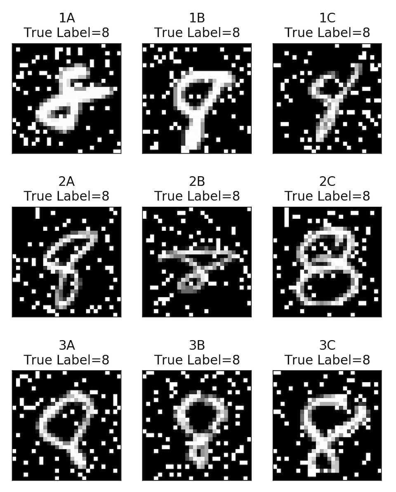
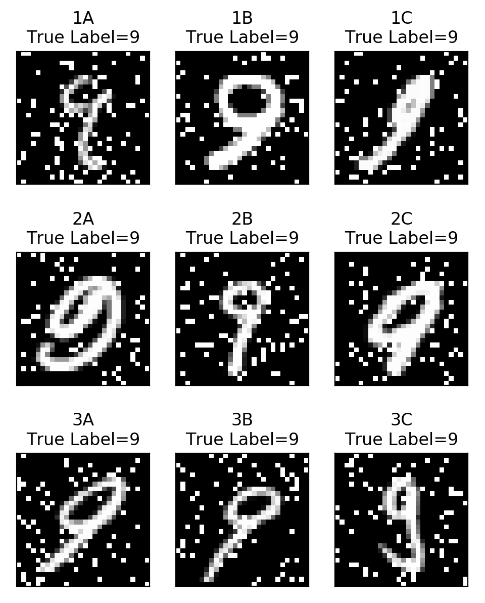

## 1A : Dataset Exploration

|                               | Training Set | Validation Set |
| ----------------------------- | ------------ | -------------- |
| Number of examples, total     | 9817         | 1983           |
| Number of positive examples   | 4913         | 1036           |
| Fraction of positive examples | 0.500        | 0.522          |

## Figure 1B : Assess Loss and Error vs. Training Iterations

See figure 1B for the results

## SA 1B : Below the plots, discuss the results you are seeing; what do they show, and why?

These plots illustrate the performance of our models as the number of training iterations increases. We can see that in both the error and log-loss plots, the training error continues to decrease as the number of iterations increases. However, we observe that between 5-10 iterations we hit a sweet-spot in validation-set performance. Beyond 10 iterations we start to see large increases in error and log-loss for our validation set, indicating that our model suffers from overfitting at larger iterations.

## Figure 1C: Produce a plot of the error rate as a function of C. Which hyperparameter should you select?

 illustrates our error rate over train and test as a function of different C-values. Observe that Log_10(c) = -2 is where we see the lowest error on our training set. Transforming to our exponential form, we see that the c value at the point is 10^(-2), or 0.01. In fact, using `C_grid[np.argmin(error_va_lr_c)]` returns precisely this value. Thus we should select `C=0.01` as our hyperparameter.

## Figure 1D : Produce two plots, one consisting of 9 sample images that are false positives on the validation set, and one consisting of 9 false negatives.

## Short Answer 1D: Discuss the results you are seeing in Figure 1D. What kinds of mistakes is the classifier making?

In the case of false positives, the classifier gets confused when:

- The lower loop of the eight is precariously thin/small (1B, 1C, 2A, 2B, 3A, 3B).
- There's a gap in one of the loops (1A, 1C, 3C).

In the case of false negatives, the classifier gets confused when:

- The down-stroke of the nine is angled on a diagonal (1B, 1C, 2B, 2C, 3A, 3B)
- The down-stroke of the nine ends in a curly flourish (1A, 2A, 3C)
- And when the main loop of the nine is inordinately large (1B, 2A, 2C)

## Figure 1E

TODO: Reshape the weight coefficients into a (28 × 28) matrix, corresponding to the pixels of the original images, and plot the result using imshow(), with colormap RdYlBu, vmin=-0.5, and vmax=0.5. Place this plot into your PDF as a properly captioned figure.

## Short Answer 1E

TODO:

- Which pixels have negative weights, and thus have high-intensity values correspond to the negative class ('8')?
  **Answer**: Areas with negative weights include the outer-curves of the image and a sickle-shaped region starting at true center, diagonally stretching down towards the lower left corner, then curving back up and over towards the right side of the image to connect with that upper-, outer-curve.

- Which pixels have positive weights, and thus have high-intensity values correspond to the positive class ('9')?
  **Answer**: Areas with high positive weights include the middle-left and middle-right of the image, encased inside the outer-curves with negative weights, as well as a small region just below the head of the sickle in the bottom-left of the image.

- Why do you think this is the case?
  **Answer**: With respect to the negative weights, the loops of the eights I think tend to balloon out, resulting in the outer cureves. Additionally, the negative diagonal region is due to the final-stroke of the eight typically cutting straight across looped regions to close the figure where the initial pen-placement occurs. With respect to the positive weights, I think the down-stroke of the nine typically cuts through a region of pixels that a loopy eight normally doesn't. Additionally, I think 9's with a large main loop will have a tendency to touch pixels in the middle-left that, on the final diagonal stroke of the eight, typically aren't active in 8 images.
